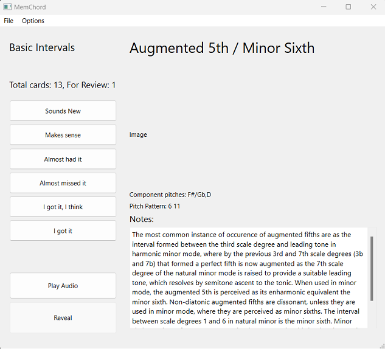

# MemChord
MemChord is a small rudimentary ear-training application, written in Python, that applies the [SuperMemo2 (SM-02)](https://en.wikipedia.org/wiki/SuperMemo#Description_of_SM-2_algorithm) spaced repetition algorithm to present cards (loaded from decks) which comprise of information about chords represented via patterns in arbitrary (randomized) keys to aid the user in fully internalizing the instrinsic relationships between the component pitches of chords as well as any associated information pertinent to the role of said chord in music.

# Dependencies
1. `json`: python module for serializing and deserializing data into JSON
2. [msgpack](https://github.com/msgpack/msgpack-python): python module for serializing and deserializing data into [MessagePack](https://github.com/msgpack/msgpack), an efficient, safe and minimalist alternative to pickle
3. [Pyside6](https://doc.qt.io/qtforpython-6/): The official python bindings for the Qt Framework
3. `rtmidi`: Python bindings for [RtMidi](https://github.com/thestk/rtmidi) which provides cross-platform real-time MIDI port I/O.

# General Instructions

1. Firstly, a deck must be opened by either using the key combination [Ctrl+O] or selecting from the menu 'File' -> 'Open Deck'
2. Once the deck has been opened, cards that are due for review will be automatically scheduled.
3. To introduce new cards into the review session press [Crtl+N] or selected from the menu 'Options' -> 'Schedule New' and enter a natural number in the input dialog to indicate the number of new cards to be introduced from the last of the cards previously studied.
4. Settings pertaining to the interval of time between notes in an arpeggio and the duration of the chord may be changed via the 'Options' -> 'Configure'
5. The 'Play Audio' button will play the chord/arpeggio currently selected as per the review schedule, and the 'Reveal' button when clicked will show information pertaining to the chord.
6. The buttons 'Sounds New', 'Makes sense', 'Almost had it', 'Almost missed it', 'I got it, I think', and 'I got it' correspond to options 0,1,2,3,4, and 5 specified in the SM-02 algorithm.

# Planned Features
1. Display the randomly generated chord in music notation (sheet music)
2. More exhaustive decks.

# Similar Projects
[GNU Solfege](https://www.gnu.org/software/solfege/solfege.html) is an ear-training program (coincidentally written in python) whose features include excercises to identify chords by year, sing chords, sing chord members, rhythm dictation, identification of cadences and harmonic progressions.